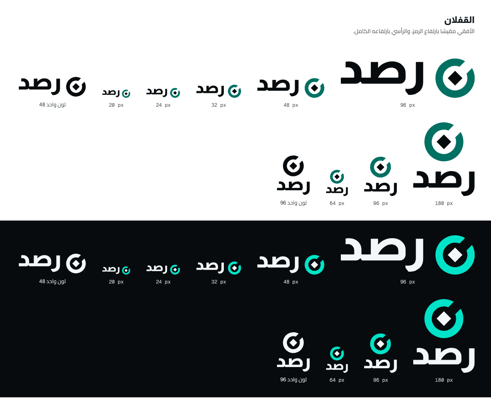
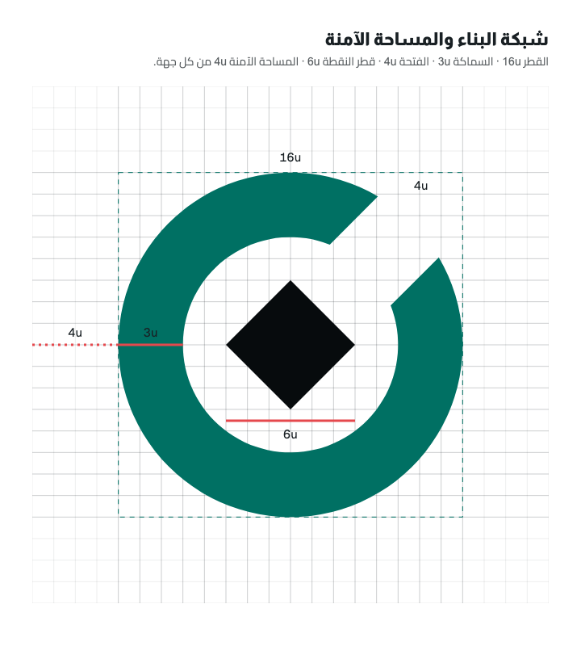
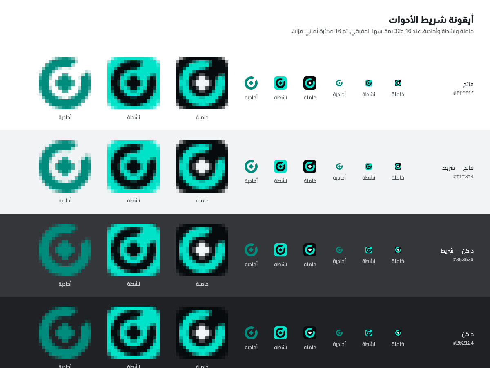
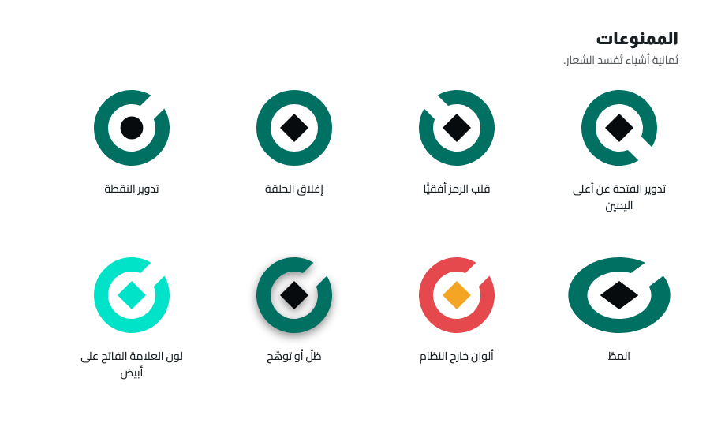

# هوية رصد — دليل الاستخدام

> الشعار المعتمَد في [`STAGES/01`](../../STAGES/01.md) (2026-09-29). كيف اختير ولماذا في
> [`directions.md`](directions.md). **هذا المجلّد أصول لا شيفرة مشحونة.** الهندسة نفسها في
> `src/ui/mark-geometry.ts` منذ [`STAGES/03`](../../STAGES/03.md)، يقرؤها `build.mjs` هنا
> والمكوّن `RasdMark.tsx` ومولِّد أيقونات الإضافة ([ADR 0024](../ADR/0024-mark-v3-in-code.md)).

## الشعار

شكلان: **حلقة** مفتوحة على القطر الصاعد إلى أعلى اليمين، وفي مركزها **نقطة معيّنة**.
الحلقة عدسة الفحص وحلقة قياس حدّة البصر. والنقطة وحدة القياس في الخطّ العربي وبكسل
الشاشة معًا.

## البناء

كل قياس مضاعف لوحدة واحدة `u`، وقطر الحلقة `16u`.

| العنصر       | القصّ العادي        | القصّ الصغير        |
| ------------ | ------------------- | ------------------- |
| يُستعمل      | من 24 بكسل فصاعدًا  | من 16 إلى 20 بكسل   |
| قطر الحلقة   | `16u`               | `16u`               |
| سماكة الحلقة | `3u`                | `3u`                |
| عرض الفتحة   | `4u`                | `4.5u`              |
| قطر النقطة   | `6u`                | `6.5u`              |
| اتجاه الفتحة | 45° إلى أعلى اليمين | 45° إلى أعلى اليمين |

الفتحة شريط متوازي الحافّتين، فحافّتاها توازيان ضلعَي النقطة. والقصّ الصغير ليس تحجيمًا
للعادي: الفتحة `3u` و`4u` تذوبان في تنعيم الحوافّ عند 16 بكسل
([`tests/07-cuts.png`](tests/07-cuts.png)).

## القفلان

| القفل  | حجم الخطّ     | الفراغ                      | المحاذاة                               |
| ------ | ------------- | --------------------------- | -------------------------------------- |
| الأفقي | `1.2 ×` القطر | `5u` بين حبر الكلمة والرمز  | مركز الرمز على مركز حبر الكلمة رأسيًّا |
| الرأسي | `0.9 ×` القطر | `4u` بين الرمز وأعلى الكلمة | الاثنان متمركزان أفقيًّا               |

- **الرمز يمين الكلمة** في القفل الأفقي: يسبقها في اتجاه القراءة. لا يُنقل إلى يسارها.
- **الكتابة** «رصد» بخطّ Almarai ExtraBold محوَّلة إلى مسارات، فلا يعتمد أي ملفّ على وجود
  الخطّ. صندوق حبرها `1747 × 711` عند حجم 1000، وخطّ القاعدة عند `473`.
- **لماذا `1.2`:** عندها سماكة القائم في الحرف (`0.155em`، مقيسة) تساوي `0.186` من القطر،
  وسماكة الحلقة `0.1875` منه. قلم واحد للرمز والكلمة.
- **قُرّر ضبط الكلمة لا رسمها.** Almarai خطّ صوت العلامة في الواجهة كلّها، وكلمة مرسومة
  بيد تفصل الشعار عنها. الخطوط الثلاثة وسلالم الألوان لم تتغيّر.

## المساحة الآمنة وأصغر حجم

- **المساحة الآمنة `4u`** من كل جهة — ربع القطر. لا نصّ ولا حافّة ولا عنصر داخلها. وللقفل
  المقدار نفسه محسوبًا من قطر رمزه.
- **أصغر حجم للرمز 16 بكسل**، بالقصّ الصغير. لا يُستعمل دونها.
- **أصغر ارتفاع للقفل الأفقي 20 بكسل.** دونه يُستعمل الرمز وحده.

## الألوان

| النسخة  | الحلقة                  | النقطة والكلمة       | تُستعمل على                         |
| ------- | ----------------------- | -------------------- | ----------------------------------- |
| `dark`  | `signal/300` `#00e3c9`  | `ink/50` `#f4f7f9`   | السطوح الداكنة                      |
| `light` | `signal/700` `#007063`  | `ink/1000` `#070b0d` | السطوح الفاتحة                      |
| `mono`  | لون واحد يرثه من السياق | نفسه                 | طباعة بلون واحد، أو فوق لون العلامة |

داخل المنتج يُستعمل المكوّن بالدرجة `Adaptive`: الحلقة مربوطة بـ`text/brand` والنقطة
بـ`text/primary`، فيتبع الشعار الوضع الفاتح والداكن بلا تبديل يدوي.

| الزوج                               | التباين   |
| ----------------------------------- | --------- |
| `signal/300` على `ink/1000`         | 12.07 : 1 |
| `signal/700` على الأبيض             | 6.00 : 1  |
| `signal/700` على `ink/50`           | 5.58 : 1  |
| `signal/300` على الأبيض — **ممنوع** | 1.64 : 1  |

## أيقونة شريط الأدوات

| الحالة | البلاطة      | الحلقة                 | النقطة     | المعنى                         |
| ------ | ------------ | ---------------------- | ---------- | ------------------------------ |
| خاملة  | `ink/1000`   | `signal/300`           | `ink/50`   | لا أداة من رصد تعمل على الصفحة |
| نشطة   | `signal/300` | `ink/1000`             | `ink/1000` | أداة من رصد تعمل على الصفحة    |
| أحادية | بلا بلاطة    | `signal/600` `#008c7c` | نفسها      | حين يُطلب لون واحد             |

- **الفرق بين الحالتين فرق إضاءة** لا فرق لون وحده: بلاطة داكنة تصير مضاءة. فيُرى لمن لا
  يميّز الألوان.
- **البلاطة** نصف قطر زاويتها 22.37% من ضلعها، والعلامة تشغل 75% منه — إلا عند 16 فتشغل
  87.5% بسماكة `2.75` بكسل.
- **كل حالة تحمل تباينها في داخلها** (12.07 : 1)، فلا تعتمد على لون الشريط: البلاطة
  الخاملة تكاد تختفي على الشريط الداكن (1.23 إلى 1.64 : 1) وتبقى الحلقة والنقطة.

تباين النسخة الأحادية `signal/600`:

| الشريط    | التباين  |
| --------- | -------- |
| `#ffffff` | 4.16 : 1 |
| `#f1f3f4` | 3.74 : 1 |
| `#202124` | 3.87 : 1 |
| `#35363a` | 2.90 : 1 |

هي أعدل درجة في السلّم بين الشريطين، ولا درجة واحدة تبلغ 3 : 1 على الأربعة. فالأيقونة
الافتراضية للشريط هي البلاطة بحالتَيها، والأحادية بديل لا أصل. **وألوان الأشرطة مفترَضة**
لم تُقَس في Chrome حقيقي — تملك قياسها [`STAGES/04`](../../STAGES/04.md).

## الممنوعات

1. تدوير الفتحة عن أعلى اليمين.
2. قلب الرمز أفقيًّا — الشعار لا يُعكس في RTL ولا في غيره.
3. إغلاق الحلقة.
4. تدوير النقطة إلى دائرة.
5. المطّ: التحجيم بنسبة واحدة دائمًا.
6. ألوان من خارج الجدول أعلاه.
7. ظلّ أو توهّج أو تدرّج.
8. `signal/300` على خلفية فاتحة.

ويُضاف: لا يوضع الرمز بلون واحد ملاصقًا لنصّ عربي بلا الفراغ `5u` — حلقة بجوار حروف
تُقرأ رقم خمسة أو هاء.

## الملفّات

| المجلّد                      | المحتوى                                                                                        |
| ---------------------------- | ---------------------------------------------------------------------------------------------- |
| [`svg/`](svg/)               | الرمز بقصَّيه، والقفلان، والكتابة، وأيقونة الشريط — كلٌّ بنُسخه `mono` و`light` و`dark`        |
| [`png/`](png/)               | الرمز بأربع درجات عند 16 و32 و48 و128، والأيقونة خاملة ونشطة عند الأربعة، والأحادية عند 16 و32 |
| [`tests/`](tests/)           | أسود على أبيض · أبيض على أسود · الوضع الفاتح · الوضع الداكن · شريط الأدوات · القفلان · القصّات |
| [`directions/`](directions/) | الشعار السابق والاتجاهات الثلاثة ومقارنتها عند 16                                              |
| [`guide/`](guide/)           | شبكة البناء والممنوعات                                                                         |

أسماء الملفّات: `rasd-<العنصر>-<النسخة>[-<المقاس>]`. النسخة `ink` و`white` في `png/` هما
`mono` ملوَّنًا بالحبر وبالورق.

**إعادة التوليد:** `node Docs/Brand/build.mjs` — يحتاج Chrome، ويُعيَّن مساره بـ`RASD_CHROME`
إن لم يكن في موضعه المعتاد. الهندسة في `src/ui/mark-geometry.ts` وطريقة الإخراج في ذلك الملفّ، وكل ما في المجلّدات الخمسة مخرَج:
لا يُحرَّر SVG ولا PNG بيد. الملفّات المودَعة وُلّدت بـChrome 153.0.8010.54، وتشغيلان متتاليان عليه أخرجا الملفّات الـ59 متطابقة بايتًا. وناتج البكسل قد يختلف بين إصدارَي متصفّح بلا تغيّر في المصدر،
فملفّات SVG هي المرجع عند أي خلاف ([ADR 0016 §4](../ADR/0016-mark-geometry-single-source.md)).

## مكوّنات Figma

الملفّ `Gr0dOsmjcVBcaX9M1slf5m`، الصفحة `03 — Logo`. مكوّنات الشعار السابق حُذفت في
[`STAGES/02`](../../STAGES/02.md) بعد استبدال نُسخها الـ59 وبلوغ عدّها صفرًا.

| المكوّن               | الخصائص                                           | الرابط                                                                                |
| --------------------- | ------------------------------------------------- | ------------------------------------------------------------------------------------- |
| `Rasd Symbol · v3`    | `Cut` عادي وصغير × `Tone` خمس درجات               | [`246:308`](https://www.figma.com/design/Gr0dOsmjcVBcaX9M1slf5m/Rasd?node-id=246-308) |
| `Rasd Wordmark · v3`  | `Tone` ثلاث درجات                                 | [`247:323`](https://www.figma.com/design/Gr0dOsmjcVBcaX9M1slf5m/Rasd?node-id=247-323) |
| `Rasd Lockup · v3`    | `Layout` أفقي ورأسي × `Tone` خمس درجات            | [`247:384`](https://www.figma.com/design/Gr0dOsmjcVBcaX9M1slf5m/Rasd?node-id=247-384) |
| `Rasd Icon Tile · v3` | `Size` أربعة مقاسات × `State` خاملة ونشطة وأحادية | [`247:316`](https://www.figma.com/design/Gr0dOsmjcVBcaX9M1slf5m/Rasd?node-id=247-316) |
| توثيق v3              | سبعة أقسام تبدأ من الترويسة                       | [`248:298`](https://www.figma.com/design/Gr0dOsmjcVBcaX9M1slf5m/Rasd?node-id=248-298) |

كل تعبئة في المكوّنات مربوطة بمتغيّر لون، والمسارات متجهة قابلة للتحرير. القفل مبنيّ من
نسختَين: نسخة من الرمز ونسخة من الكتابة، فتعديل أحدهما يسري على القفل.

## ما يلي هذه المرحلة

| العمل                                                                                                                                              | تملكه                             |
| -------------------------------------------------------------------------------------------------------------------------------------------------- | --------------------------------- |
| ~~نقل الهندسة إلى `src/ui/mark-geometry.ts`، وتحديث `RasdMark.tsx`، وتوليد `public/icons/`~~ — منفَّذ، ADR 0024. وتبديل أيقونة الشريط بين الحالتين | [`STAGES/03`](../../STAGES/03.md) |
| اختبار الأيقونة في شريط Chrome حقيقي بالوضعين                                                                                                      | [`STAGES/04`](../../STAGES/04.md) |
| أيقونة المتجر وموادّه                                                                                                                              | [`STAGES/28`](../../STAGES/28.md) |
