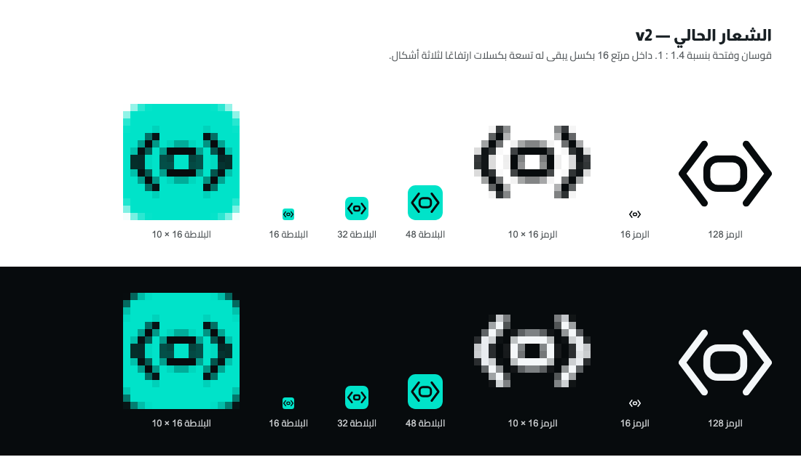
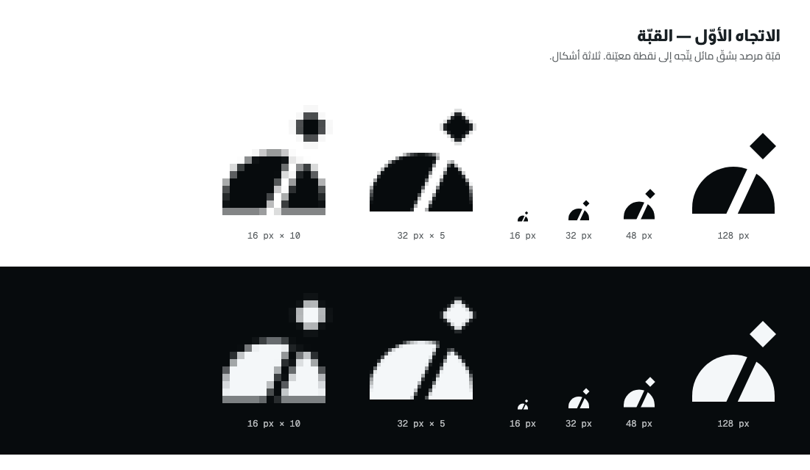
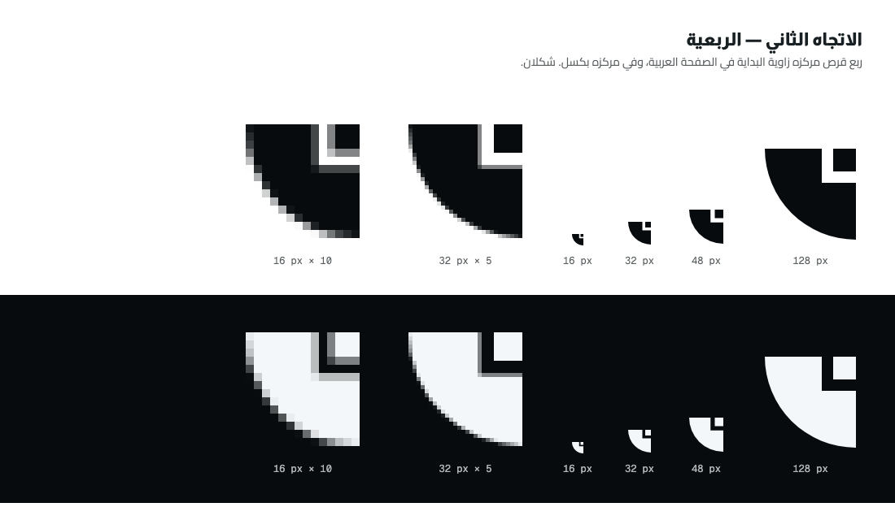
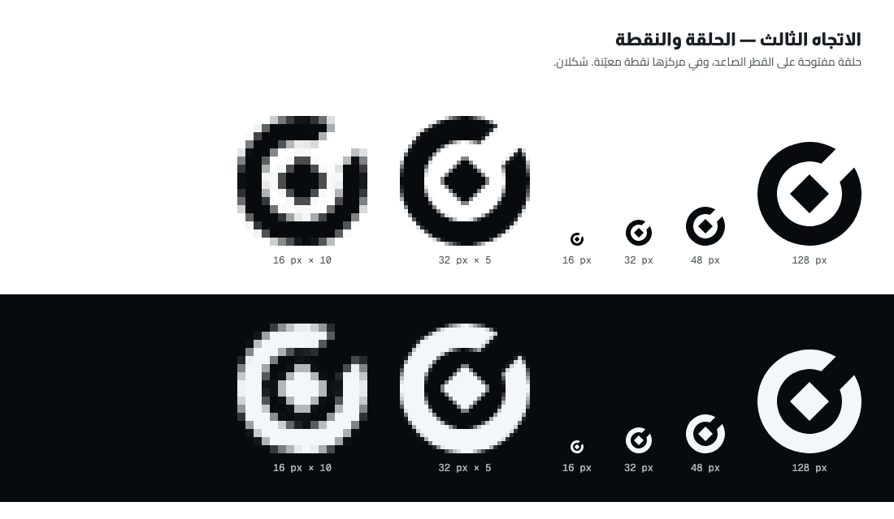
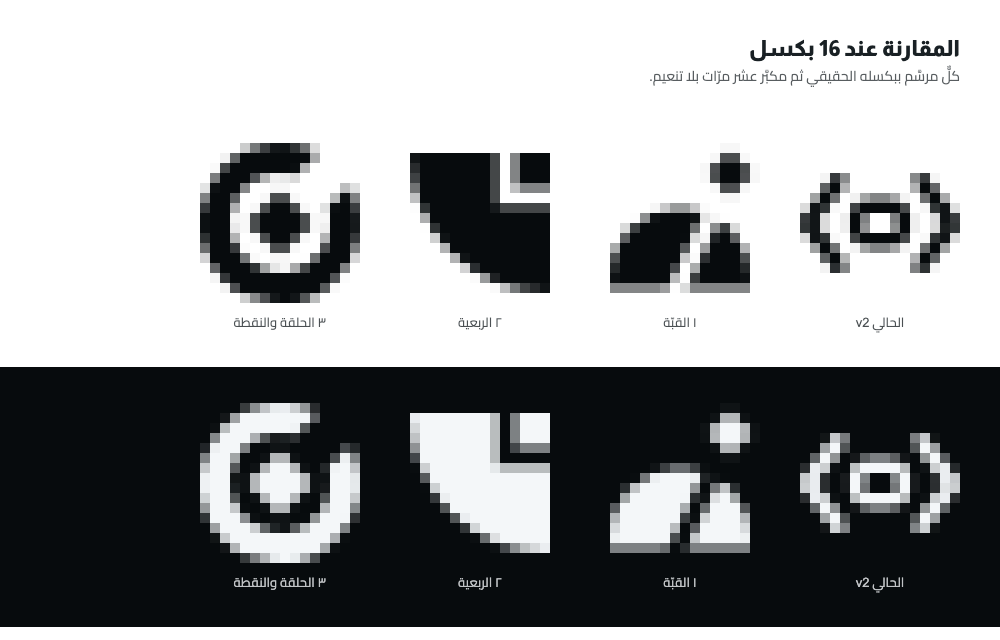
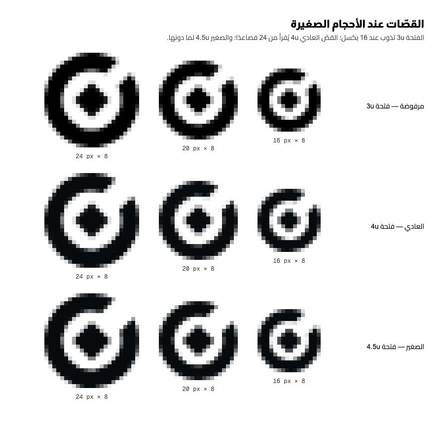

# اتجاهات الشعار

> سجلّ [`STAGES/01`](../../STAGES/01.md): تحليل الشعار الحالي، ثم ثلاثة اتجاهات رُسمت
> واختُبرت ببكسلها الحقيقي عند 16، ثم الترشيح بمعاييره. دليل استخدام الشعار المعتمَد في
> [`README.md`](README.md). كل صورة هنا يولّدها `node Docs/Brand/build.mjs`.

## 1. الشعار الحالي — ما الذي لا يُرضي فيه

الشعار الحالي (`Rasd Symbol · v2`) قوسا شيفرة يحيطان بفتحة: `< ▢ >`.

| الملاحظة                                                                                                     | الدليل                                                                                        |
| ------------------------------------------------------------------------------------------------------------ | --------------------------------------------------------------------------------------------- |
| **لا يملك المربّع.** نسبته 1.4 : 1، وكل سياق مهمّ له مربّع: شريط الأدوات، أيقونة المتجر، صفحة الإضافات       | داخل بلاطة 16 بكسل يبقى للعلامة 14.1 × 8.7 بكسل — `0.88 × 16` عرضًا بنسبة القصّ `650 / 1052`  |
| **ثلاثة أشكال في تسعة بكسلات.** قوسان وحلقة يتقاسمون ارتفاعًا لا يسع أحدها                                   | الصورة أعلاه، العمود المكبَّر: الفتحة الداخلية أقلّ من بكسلين ارتفاعًا، والقوسان درجات رمادية |
| **يحتاج بلاطة ليُرى.** العلامة وحدها تفقد حضورها على شريط الأدوات                                            | مقيس ومكتوب في [ADR 0016 §5](../ADR/0016-mark-geometry-single-source.md)                      |
| **متانته مصنوعة لا أصيلة.** سبع قصّات × أربع درجات = 28 نسخة كي يصمد شكل واحد                                | `src/ui/mark-geometry.ts`                                                                     |
| **يقول «شيفرة» لا «رصد».** `< >` رمز عامّ لمحرّرات الشيفرة وأزرار التضمين، ولا شيء فيه من الرصد ولا من الاسم | حكم تصميمي، لا قياس                                                                           |
| **كتابته لاتينية.** «Rasd» بخطّ جاهز، والمنتج عربي فقط                                                       | الإطار `68:416` في Figma، و[ADR 0022](../ADR/0022-i18n-catalog-dropped.md)                    |

سبب عدم رضا المالك لم يُكتب نصًّا؛ ما سبق تحليل المساعد، وأربعة من بنوده الستّة مقيسة.

## 2. ما الذي يميّز رصد

- **أداة قياس بصري لا كاميرا.** أدوات الالتقاط تلتقط. رصد يلتقط ثم يفحص ويقيس ويستخرج
  اللون ويقارن التنفيذ بالتصميم. فالكاميرا وزوايا القصّ الأربع لا تصفه.
- **عربي أوّلًا.** الصفحة تبدأ من أعلى اليمين، والاسم كلمة عربية لها معنى: الرصد مراقبة
  دقيقة، ومنه المرصد.
- **محلّي.** لا حساب ولا خادم. فشعار على هيئة عين يوحي بمراقبة المستخدم، وهو عكس ما
  يعد به المنتج. استُبعدت العين لهذا السبب قبل أن تُرسم.

شعارات الفئة التي أمكن التحقّق من شكلها (من أيقونات مواقعها لا من المتجر — القسم 6):
Awesome Screenshot وColorZilla حلقة بيضاء داخل مربّع ملوّن، وHoverify مؤشّر على بلاطة داكنة.

## 3. المعايير

| المعيار           | السؤال                                            |
| ----------------- | ------------------------------------------------- |
| الوضوح عند 16     | هل تبقى الأشكال منفصلة ومقروءة ببكسلها الحقيقي؟   |
| التميّز           | هل يشبه شعارًا معروفًا أو أيقونة نظام شائعة؟      |
| الرمزية           | هل يقول «رصد وفحص بصري» لمن لا يعرف المنتج؟       |
| لون واحد          | هل يُرسم بلون واحد بلا خسارة؟                     |
| الصلاحية العالمية | هل يُفهم بلا قراءة العربية، وبلا إيحاء غير مقصود؟ |
| قلّة الأشكال      | كم شكلًا فيه؟                                     |

## 4. الاتجاهات الثلاثة

كل اتجاه مستمدّ من أحد ثلاثة: الرصد، والدقّة، والفحص البصري.

### الاتجاه الأوّل — القبّة (من الرصد)

**الفكرة:** قبّة مرصد بشقّها الذي يخرج منه المنظار، متّجهًا إلى نقطة معيّنة في أعلى
اليمين. أقرب الثلاثة إلى الاسم حرفيًّا: رصد ← مرصد.

**عند 16 بكسل:** الشقّ المائل يذوب في تنعيم الحوافّ فتصير القبّة كتلة بخدش، والنقطة
تنفصل عنها فيُقرأ الشكلان غير مترابطَين.

**الحكم:** مرفوض. ثلاثة أشكال، ورسم تصويري يحيل إلى الفلك لا إلى صفحة الويب. وبشقّ
رأسي ونقطة فوقه قُرئ أيقونة «مستخدم» (رأس وكتفان) — جُرِّب واستُبعد.

### الاتجاه الثاني — الربعية (من الدقّة)

**الفكرة:** الربعية آلة الرصد التي تُقاس بها زاوية ارتفاع النجم. هنا ربع قرص مركزه
الزاوية العليا اليمنى — حيث تبدأ الصفحة العربية — وفي مركزه بكسل. ويقرؤه المصمّم زاوية
مستديرة ومقبض نصف قطرها.

**عند 16 بكسل:** أوضح الثلاثة. كتلة مصمتة وبكسل بأربعة بكسلات وفراغ بكسلين.

**الحكم:** مرفوض. صورته الظلّية قويّة، لكن قراءته الأولى عند من لا يعرف الفكرة «قطاع
من مخطّط دائري» أي تحليلات، لا أداة رصد. الوضوح وحده لا يكفي إن قال الشكل شيئًا آخر.

### الاتجاه الثالث — الحلقة والنقطة (من الفحص البصري)

**الفكرة:** شكلان.

- **الحلقة** عدسة الفحص، وهي **حلقة لاندولت** التي يُقاس بها حدّة البصر: حلقة بفتحة
  واحدة. رمز للدقّة البصرية لا يحتاج لغة.
- **النقطة المعيّنة** وحدة القياس في الخطّ العربي المنسوب — بها تُضبط نِسَب الحروف — وهي
  على الشاشة بكسل. وحدتا قياس في شكل واحد.
- **الفتحة** على القطر الصاعد إلى أعلى اليمين، وحافّتاها توازيان ضلعَي النقطة، كأن
  النقطة اقتُطعت من الحلقة ووُضعت في بؤرتها: الالتقاط.

وكلمة «رصد» بلا نقط في حروفها الثلاثة، فالنقطة في الرمز هي نقطتها الوحيدة.

**عند 16 بكسل:** الحلقة والنقطة منفصلتان بهالة بكسل، والفتحة ظاهرة بعد توسيعها (القسم 7).
النقطة تُقرأ نقطة مستديرة لا معيّنًا عند هذا الحجم؛ المعيّن يظهر من 24 فصاعدًا.

**الحكم:** المرشَّح.

## 5. المقارنة والترشيح

| المعيار           | ١ القبّة          | ٢ الربعية             | ٣ الحلقة والنقطة                          |
| ----------------- | ----------------- | --------------------- | ----------------------------------------- |
| الوضوح عند 16     | ضعيف — الشقّ يذوب | قويّ                  | جيّد — الفتحة تحتاج القصّ الصغير          |
| التميّز           | عالٍ              | عالٍ                  | متوسّط — حلقة بفتحة أسلوب معروف (القسم 6) |
| الرمزية           | واضحة لكنها فلكية | غامضة، وتُقرأ تحليلات | واضحة: عدسة تركّز على نقطة                |
| لون واحد          | نعم               | نعم                   | نعم                                       |
| الصلاحية العالمية | متوسّطة           | عالية                 | عالية                                     |
| عدد الأشكال       | 3                 | 2                     | 2                                         |

**الترشيح: الاتجاه الثالث.** هو الوحيد الذي يجمع وضوحًا كافيًا عند 16 برمزية تقول ما
يفعله المنتج. الربعية أوضح منه بكسلًا لكنها تقول شيئًا آخر، والقبّة تقول الاسم لكنها لا
تُقرأ صغيرة. وضعفه المعلَن — أن الحلقة بفتحة أسلوب مستعمَل — عولج بما يميّزه: فتحة مائلة لا
أفقية، ونقطة معيّنة في المركز، ولونان.

المالك فوّض اعتماد الاتجاه المرشَّح (2026-09-29، [`Docs/Scope.md`](../Scope.md)). وطلب
تعديل منه بعد العرض يُنفَّذ ملحقًا للمرحلة 01.

### ما استُبعد قبل الثلاثة

| الشكل                           | سبب الاستبعاد                                          |
| ------------------------------- | ------------------------------------------------------ |
| حلقة مغلقة ونقطة                | تُقرأ زرّ اختيار أو هدفًا. الفتحة هي ما يُخرجها من ذلك |
| معيّن مستدير الزوايا بثقب دائري | يطابق شعار Hashnode مقلوب الألوان                      |
| زاويتا قصّ متقابلتان ونقطة      | أيقونة «تكبير» الشائعة بنقطة زائدة                     |
| ورقة أو عين ببؤبؤ مربّع         | إيحاء المراقبة — القسم 2                               |
| قوس ربع دائرة ونقطة             | أيقونة RSS مقلوبة، وتُقرأ حرف نون مائلًا               |
| قرص مصمت بثقب معيّن             | عملة أو حلقة معدنية                                    |
| حلقة بفتحة أفقية                | الأقرب إلى شعار Coinbase — القسم 6                     |

## 6. المراجعة المستقلّة

راجع المرشَّحَ وكيلٌ واحد لم يرسمه (النموذج `sonnet` في أداة الوكلاء)، وبحث عن الأشباه وتحقّق من شكل كل شعار
بعرضه في المتصفّح. **ليست فحص علامة تجارية قانونيًّا**، ولم يُجرَ فحص كهذا.

| الشبيه                                                                                                                | وجه الشبه                              | وجه الاختلاف                              | خطر الالتباس |
| --------------------------------------------------------------------------------------------------------------------- | -------------------------------------- | ----------------------------------------- | ------------ |
| Coinbase                                                                                                              | حلقة سميكة بفتحة واحدة ضيّقة           | فتحته أفقية ومركزه فارغ وهو داخل قرص أزرق | متوسّط       |
| Awesome Screenshot                                                                                                    | حلقة ومركز داخل مربّع، ومن الفئة نفسها | حلقته مغلقة، بلا معيّن، وبتدرّج ألوان     | متوسّط       |
| Crunchyroll · Pocket Casts · ColorZilla · Screen Studio · Opera GX · Hashnode · Google Lens · Amazon Alexa · Hoverify | حلقة أو فتحة أو لوحة ألوان قريبة       | التركيب مختلف في كلٍّ منها                | منخفض        |

**فُحص ووُجد غير مشابه:** Overcast · Grammarly · Quora · Qwant · Codecademy · Beats · Target ·
Ubiquiti · Tor · Signal · OBS Studio · Loom · CleanShot · Shottr · GoFullPage · Lightshot ·
Nimbus · CSS Peeper · VisBug · PerfectPixel · Meta Quest · Instagram.

**لم يُتحقَّق من شكله:** Coinbase Wallet · Snagit · Camo · Page Ruler. وأيقونات الإضافات
أُخذت من مواقع أصحابها لأن متجر Chrome لم يُفتح للمراجع، وقد تختلف عن أيقونة المتجر.

**قراءات غير مقصودة محتملة عند 16 بكسل:** زرّ اختيار أو تسجيل · مؤشّر تحميل · «@» · حرف
C أو G · عدسة كاميرا. **وعند الأحجام الكبيرة بجوار الكلمة:** الرقم ٥ أو حرف الهاء.
وقراءة حرف النون غير واردة لأن النقطة داخل الحلقة لا فوقها.

**خلاصة المراجع:** لا شعار يجمع فتحة مائلة ومعيّنًا في المركز ولونَي رصد، فالتركيب مميّز
بما يكفي. والخطر عامّ لا خاصّ. والتعديل الأنفع توسيع الفتحة.

## 7. ما تغيّر بعد المراجعة

الرسم الأوّل جعل الفتحة بعرض السماكة (`3u`)، على نسبة حلقة لاندولت. وقِيس عند 16 بكسل
أنها تذوب فتُقرأ الحلقة مغلقة، وهذا عين ما يقرّبها من زرّ الاختيار ومن الحلقات المغلقة في
الفئة.

| القصّ   | الفتحة | النقطة | يُستعمل            |
| ------- | ------ | ------ | ------------------ |
| المرفوض | `3u`   | `6u`   | —                  |
| العادي  | `4u`   | `6u`   | من 24 بكسل فصاعدًا |
| الصغير  | `4.5u` | `6.5u` | من 16 إلى 20 بكسل  |

## 8. ما لم يُتحقَّق منه

- **لا فحص علامة تجارية.** المراجعة بحث بصري لا رأي قانوني.
- **ألوان شريط أدوات Chrome مفترَضة** (`#ffffff` · `#f1f3f4` · `#35363a` · `#202124`)،
  ولم تُقَس في Chrome حقيقي. قياسها واختبار الأيقونة في الشريط فعلًا في
  [`STAGES/04`](../../STAGES/04.md).
- **أيقونة المتجر.** هل تُترك حشوة شفّافة حول البلاطة عند 128؟ يُقرأ من مصدر المتجر
  الرسمي يوم تنفيذ [`STAGES/28`](../../STAGES/28.md).
- **لم يعرض على مستخدمين.** الأحكام في القسمين 4 و5 حكم المساعد والمراجع المستقلّ.
