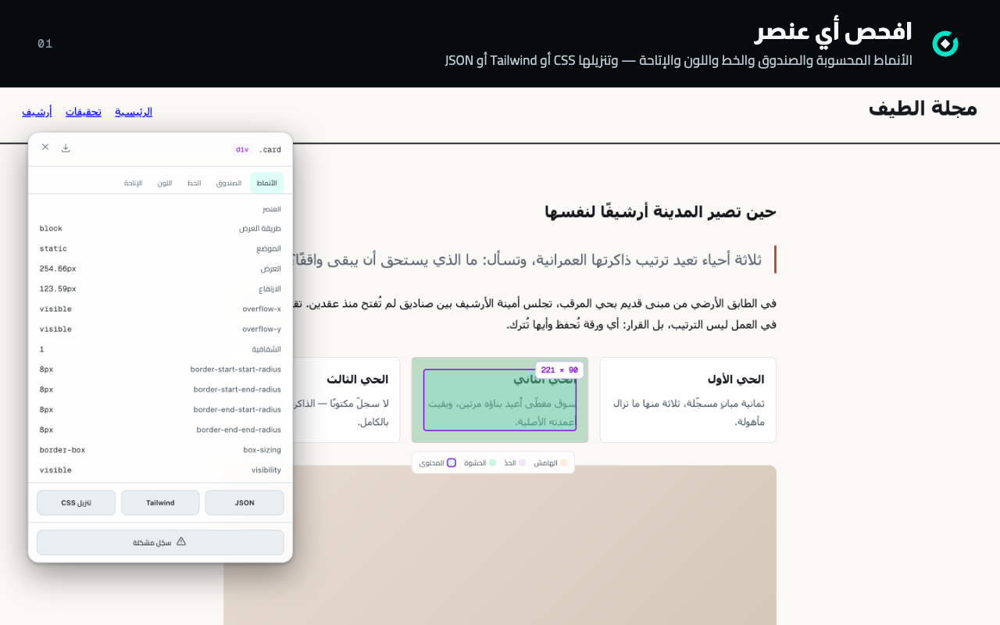
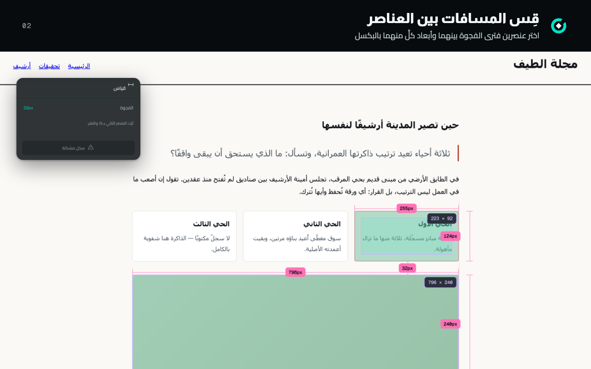
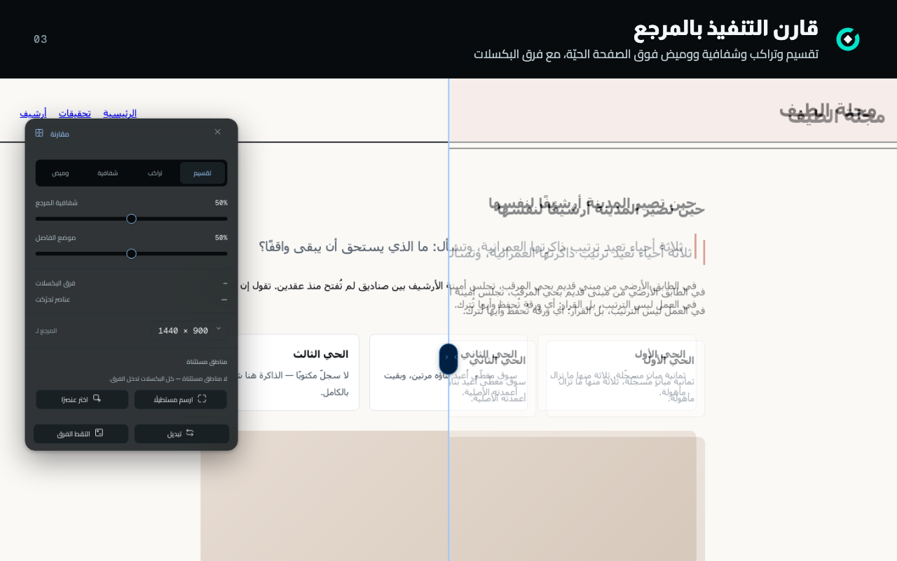
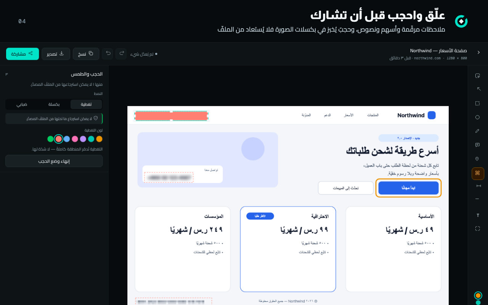
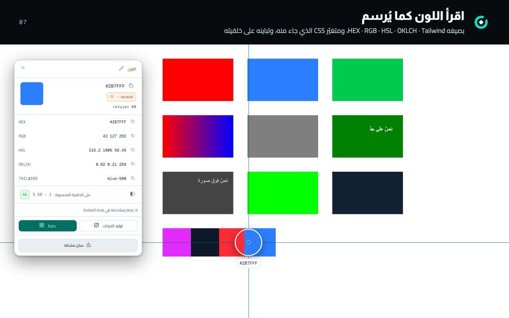
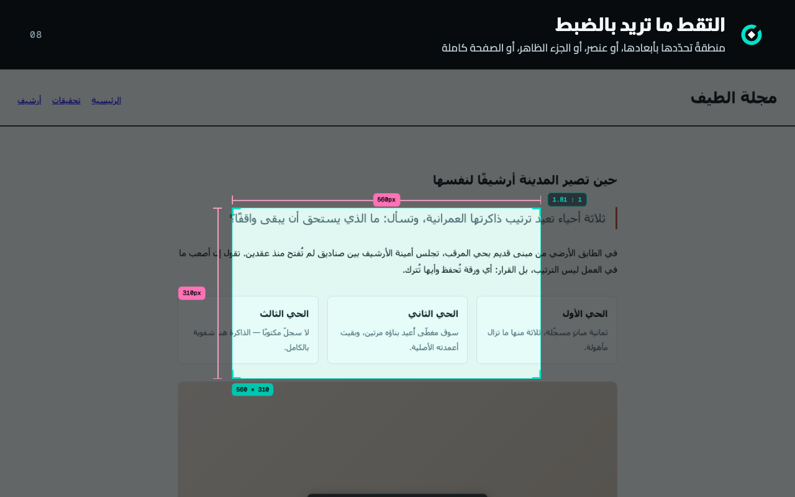
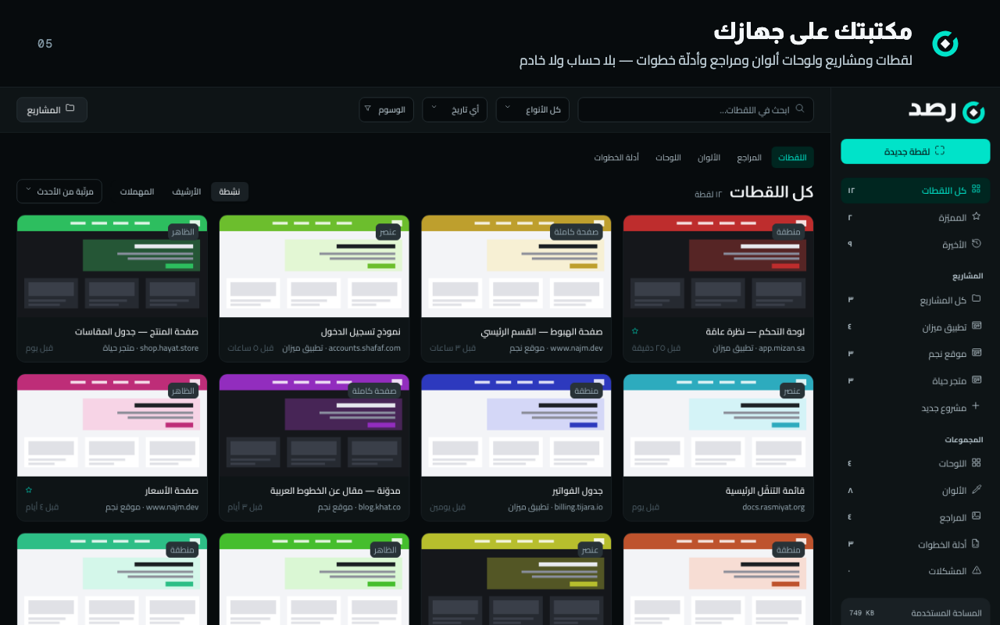
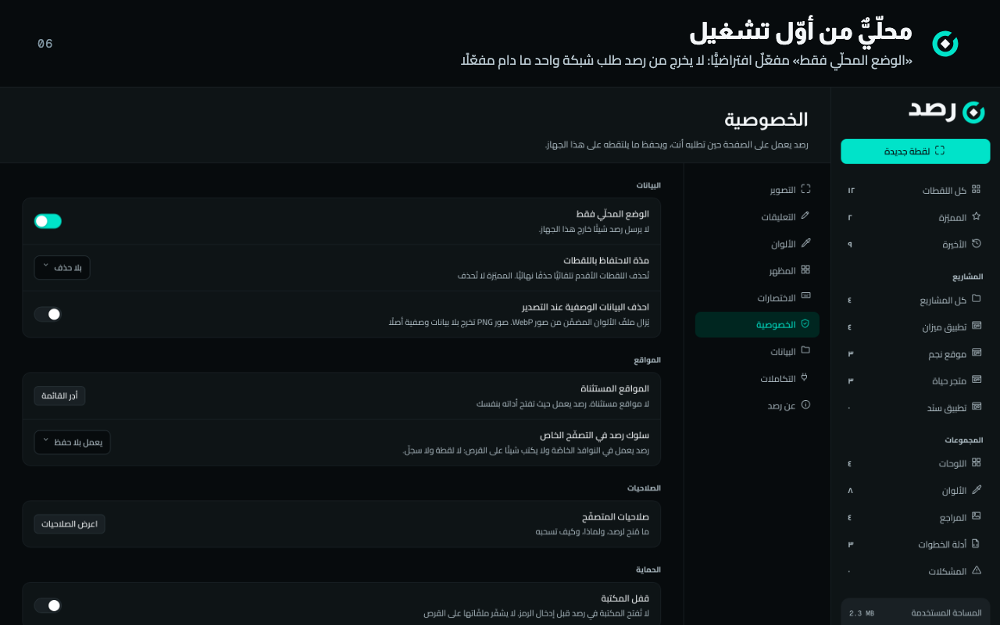

<p align="center">
  <picture>
    <source media="(prefers-color-scheme: dark)" srcset="Docs/Brand/svg/rasd-lockup-horizontal-dark.svg">
    
  </picture>
</p>

<h3 align="center">افحص الواجهة كما تُرسم</h3>

<p align="center">
  أداة فحص بصري عربية أوّلًا لواجهات الويب: تلتقط وتقيس وتفحص وتقارن فوق الصفحة نفسها،<br>
  وتحفظ ما وجدته على جهازك، وتسلّمه للمطوّر بصيغٍ يفهمها.
</p>

<p align="center">
  <a href="https://bysltan.com">bysltan.com</a> ·
  <a href="https://github.com/iSltanX/rasd">github.com/iSltanX/rasd</a> ·
  <a href="#english">English</a>
</p>

<p align="center"></p>

## ما يفعله رصد

| الميزة       | ما تفعله                                                                                                          |
| ------------ | ----------------------------------------------------------------------------------------------------------------- |
| **الالتقاط** | الجزء الظاهر، أو الصفحة كاملة، أو عنصر، أو منطقة تحدّدها بأبعادها — من النافذة أو قائمة الزر الأيمن أو الاختصارات |
| **الفحص**    | الأنماط المحسوبة والصندوق والخط واللون والإتاحة لأي عنصر، وتنزيلها CSS أو Tailwind أو JSON                        |
| **القياس**   | الفجوة بين عنصرين وأبعاد كلٍّ منهما بالبكسل، فوق الصفحة الحيّة                                                    |
| **الألوان**  | قطّارة تقرأ اللون كما يُرسم ومتغيّر CSS الذي جاء منه، ولوحة الصفحة، والتدرّجات، وتدقيق التباين في الصفحة كاملة    |
| **المقارنة** | تصميمٌ أو لقطة فوق الصفحة — تقسيم وتراكب وشفافية ووميض — بفرق البكسلات واستثناء المناطق المتغيّرة وتقرير PDF      |
| **المحرّر**  | ملاحظات مرقّمة وأسهم ونصوص وقصّ، وحجبٌ يُخبز في بكسلات الصورة فلا يُستعاد من الملفّ                               |
| **المشكلات** | ملاحظة مربوطة بالعنصر وقيمتيه المتوقَّعة والفعلية، يُعاد فحصها لتعرف أهي محلولة                                   |
| **التسليم**  | PNG وPDF، ودليل خطوات بصيغه الأربع، وحزمة تسليم للمطوّر بـMarkdown وJSON، وصفحة مشاركة تُفتح بلا إنترنت           |
| **المكتبة**  | مشاريع ووسوم وبحث، وسلّة محذوفات، ونسخة احتياطية، وقفل برمز — كلّها على جهازك                                     |

## لقطات

كل لقطة من الإضافة نفسها كما يرسمها المتصفّح — لا تصميمٌ لها ولا واجهةٌ بديلة.

<table>
  <tr>
    <td width="50%"></td>
    <td width="50%"></td>
  </tr>
  <tr>
    <td></td>
    <td></td>
  </tr>
  <tr>
    <td></td>
    <td></td>
  </tr>
  <tr>
    <td></td>
    <td></td>
  </tr>
</table>

## الخصوصية

- **محلّيٌّ افتراضيًّا.** «الوضع المحلّي فقط» مفعّل من أوّل تشغيل، وما دام مفعّلًا لا يخرج من رصد طلب شبكة واحد —
  مقيسًا في متصفّح حقيقي على كل مسار، لا موعودًا.
- **لا صلاحية دائمة على المواقع.** رصد يعمل على الصفحة التي تطلبه عليها بنقرتك، ولا يعرض التثبيت تحذير «قراءة
  بياناتك على كل المواقع».
- **اتّصالان اختياريان فقط**، بعد إطفاء «الوضع المحلّي» وبنقرتك بعد مراجعة ما سيُرسَل: فتح Issue في مستودعك على GitHub،
  و«أبلغ عن مشكلة» إلى المطوّر — بلا رابط الصفحة ولا محتواها ولا مكتبتك.

التفصيل جملةً جملة بموضعها في الشيفرة: [`Docs/Privacy.md`](Docs/Privacy.md).

## يعمل حيث تعمل أنت

<p></p>

الحزمة نفسها بلا تعديل، مجرَّبةً في كل متصفّح على macOS: تُحمَّل بلا تحذير، ثمّ تجري رحلات رصد فيه —
الالتقاط والفحص والقياس والألوان والمقارنة والمحرّر والمكتبة والتصدير وصفر طلب شبكة. التفصيل والأوامر والفروق في
[`Docs/Launch/browsers.md`](Docs/Launch/browsers.md).

| المتصفّح    | الإصدار المجرَّب           | الحالة                                                                             |
| ----------- | -------------------------- | ---------------------------------------------------------------------------------- |
| **Chrome**  | 154.0.8037.93              | ✓ مدعوم                                                                            |
| **Edge**    | 154.0.4258.53              | ✓ مدعوم                                                                            |
| **Brave**   | 1.96.59 · Chromium 154     | ✓ مدعوم — قراءة الألوان بالبكسل تنحرف درجةً واحدة بحماية Brave من البصمة           |
| **Opera**   | 136.0 · Chromium 152       | ✓ مدعوم — يحجز ثلاثة من الاختصارات الأربعة، فتُسند يدويًّا                         |
| **Vivaldi** | 8.2.4133.80 · Chromium 152 | ✓ مدعوم                                                                            |
| Arc         | 1.167.0                    | لم يُتحقَّق منه — لا يعمل بملفّ تعريفٍ معزول، والتجربة في ملفّ المستخدم تمسّ حسابه |
| **Firefox** | 157.0 · Gecko              | ✓ مدعوم — بحزمته `rasd-<النسخة>-firefox.zip`، ولا يعمل في النوافذ الخاصّة          |
| Safari      | 27.0.1                     | خارج النطاق — يحتاج تحويل الإضافة إلى تطبيق macOS                                  |

## التثبيت

**من المتجر** — يُضاف رابط Chrome Web Store وMicrosoft Edge Add-ons هنا حين تُنشر رصد.

**من الحزمة** (للمطوّر والمختبِر):

1. `pnpm install --frozen-lockfile && pnpm build && pnpm zip` — أو حزمةٌ جاهزة `rasd-<النسخة>.zip`، تُفكّ في مجلّد.
2. افتح صفحة الإضافات: `chrome://extensions` · `edge://extensions` · `brave://extensions` · `opera://extensions` ·
   `vivaldi://extensions`.
3. فعّل **وضع المطوّر**، ثمّ **تحميل غير مضغوطة** واختر المجلّد.
4. تظهر رصد بأيقونتها **بلا تحذير صلاحيات**. ثبّتها في شريط الأدوات، وافتح أي صفحة واضغط الأيقونة.

الاختصارات الافتراضية: `⇧⌘T` منطقة · `⇧⌘E` عنصر · `⇧⌘V` الجزء الظاهر · `⇧⌘S` الصفحة كاملة (على ويندوز ولينكس
`Ctrl+Shift` مع `Q` و`E` و`V` و`S`)، وتُعدَّل من صفحة اختصارات الإضافات في المتصفّح.

## للمطوّر

```bash
nvm use && corepack enable
pnpm install --frozen-lockfile
pnpm dev            # تطوير مع إعادة تحميل تلقائية
pnpm build          # أنواع + بناء + فحص الحزمة
pnpm gate:a         # البوّابة المحلّية كاملة
```

Preact وTypeScript وVite فوق Manifest V3، بلا خادم ولا حساب. البنية والأوامر كلّها والحرّاس وطريقة العمل في
[`Docs/Development.md`](Docs/Development.md)، وقواعد التنفيذ في [`AGENTS.md`](AGENTS.md).

## Firefox

**مدعوم** بحزمةٍ خاصّة من المصدر نفسه: `pnpm build:firefox && pnpm zip:firefox` ⇐ `dist-zip/rasd-<النسخة>-firefox.zip`.
والدعم مقيسٌ بالمعيار نفسه الذي يُقاس به Chromium: أربعة عشر حارسًا في Firefox حقيقي (`pnpm verify:firefox`) — التثبيت
ومدقّق addons.mozilla.org، والنافذة، والتفعيل والقياس والفحص والألوان، والالتقاط الظاهر والكامل ونسخة التنزيلات، والمحرّر
والحجب، والتصدير PNG وPDF، والمكتبة، وتشخيص البلاغ، وبقاء الخلفية، وصفر طلب شبكة. والفروق: لا يعمل في النوافذ الخاصّة،
وإصدار النظام لا يكشفه Firefox فيصل في البلاغ `unknown`. التجربة قبل النشر في المتجر: `about:debugging` ← «This Firefox» ←
«Load Temporary Add-on» ← `manifest.json` من الحزمة مفكوكة. الدراسة والقياس في
[`Docs/Firefox/firefox_rasd.md`](Docs/Firefox/firefox_rasd.md)، والحرّاس في [`Docs/Development.md`](Docs/Development.md).

---

<a id="english"></a>

## English

<p></p>

**Rasd** is an Arabic-first visual inspection extension for people who build and review web interfaces. Capture,
measure, inspect, check colour and compare against a reference right on the live page, keep your findings in a library on
your device, and hand developers what they need — CSS, Tailwind, JSON, Markdown, step guides and comparison reports.

- **Local by default** — "Local only" is on from the first run; while it is on, Rasd sends no network request at all.
- **No permanent site access** — it works only on the page where you invoke it.
- **Arabic-first** — the interface is Arabic and right-to-left, in dark and light themes.

<p></p>

Firefox is supported with its own package from the same source (`pnpm zip:firefox`), proven by fourteen guards in real
Firefox (`pnpm verify:firefox`); it does not run in private windows.
Store links will be added here once Rasd is published.

---

<p align="center">
  تصميم وتطوير <b>سلطان — Sultan</b> · <a href="https://bysltan.com">bysltan.com</a> · <a href="https://github.com/iSltanX/rasd">iSltanX/rasd</a><br>
  © 2026 — جميع الحقوق محفوظة. وتراخيص المكتبات مفتوحة المصدر المضمَّنة في <code>THIRD_PARTY_LICENSES.txt</code> داخل الحزمة.
</p>
