<p align="center">
  <picture>
    <source media="(prefers-color-scheme: dark)" srcset="Docs/Brand/svg/rasd-lockup-horizontal-dark.svg">
    
  </picture>
</p>

<h3 align="center">افحص الواجهة كما تُرسم</h3>

<p align="center">
  إضافة متصفّح للفحص البصري، عربيةٌ أوّلًا: تلتقط وتقيس وتفحص وتقارن فوق الصفحة نفسها،<br>
  وتحفظ ما وجدته على جهازك، وتسلّمه للمطوّر بصيغٍ يفهمها.
</p>

<p align="center">
  <a href="#english">English</a> · <a href="Docs/Privacy.md">الخصوصية</a> · <a href="#developer">للمطوّر</a>
</p>

<p>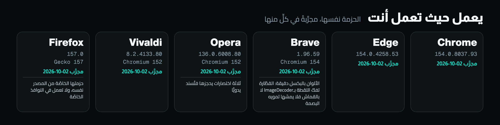</p>

<p>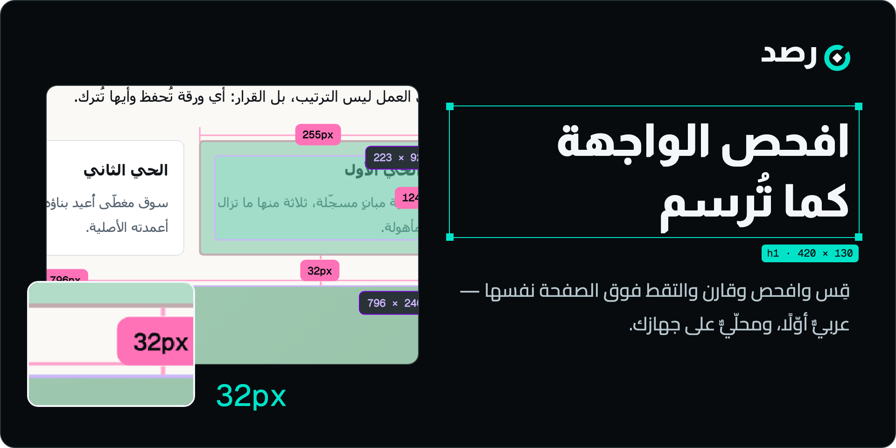</p>

## ما يفعله رصد

<p>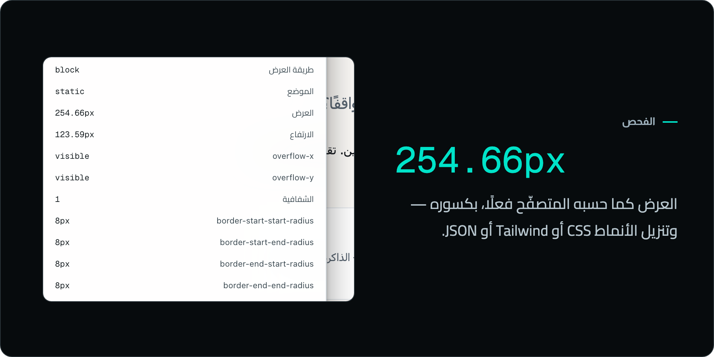</p>

الفحص يقرأ الأنماط المحسوبة والصندوق والخط واللون والإتاحة لأي عنصر، ويُنزّلها CSS أو Tailwind أو JSON.

<p>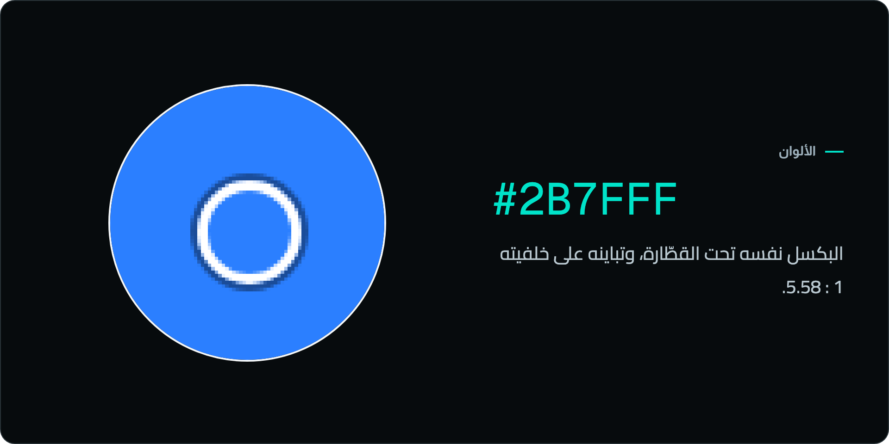</p>

القطّارة تقرأ اللون كما يُرسم ومتغيّر CSS الذي جاء منه، ومعها لوحة ألوان الصفحة وتدرّجاتها وتدقيق التباين في الصفحة كاملة.

<p>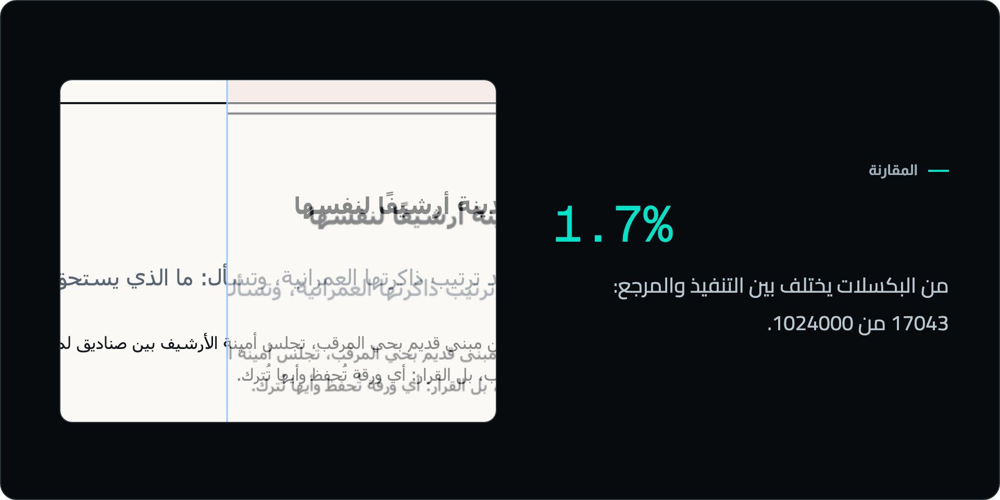</p>

المقارنة تضع تصميمًا أو لقطة فوق الصفحة — تقسيم وتراكب وشفافية ووميض — بنسبة البكسلات المختلفة واستثناء المناطق
المتغيّرة وتقرير PDF.

<p>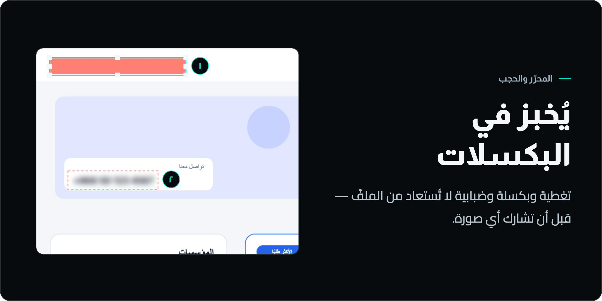</p>

المحرّر: ملاحظات مرقّمة وأسهم ونصوص وقصّ، وحجبٌ يُخبز في بكسلات الصورة فلا يُستعاد من الملفّ.

<p>
  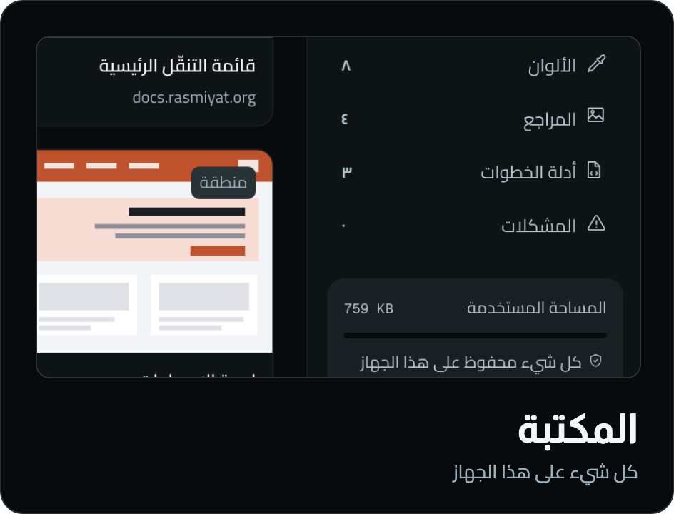
  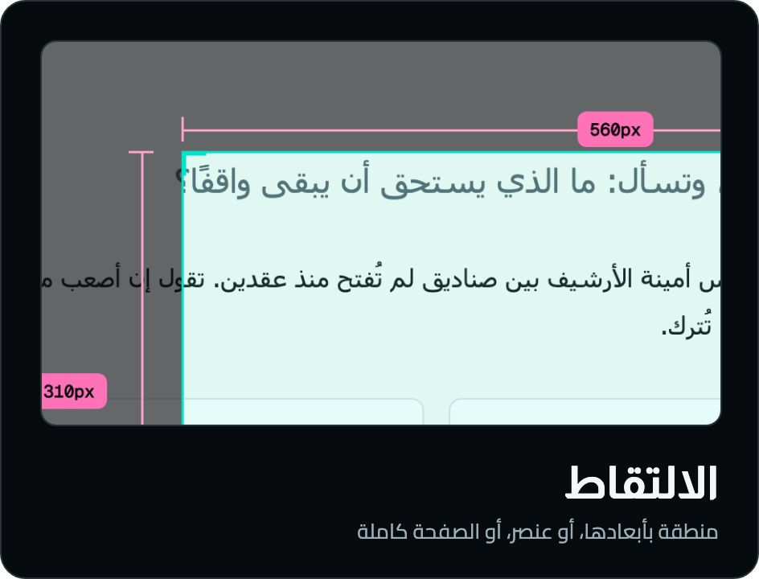
</p>

ومعها القياس بين عنصرين بالبكسل، والمشكلات المربوطة بالعنصر، والتسليم: صورٌ وتقارير ودليل خطوات وحزمة Markdown
وJSON، وصفحة مشاركة تُفتح بلا إنترنت.

## كيف يعمل

<p>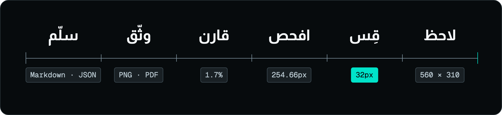</p>

## الخصوصية

<p>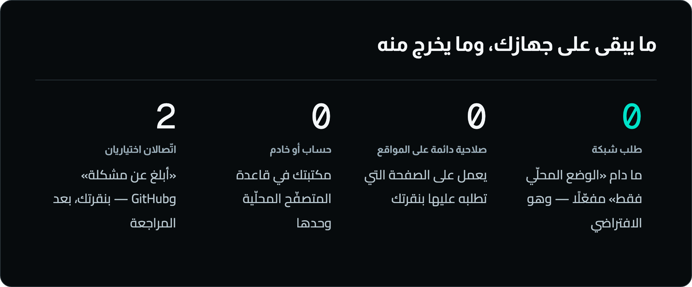</p>

- **محلّيٌّ افتراضيًّا:** «الوضع المحلّي فقط» مفعّل من أوّل تشغيل، وما دام مفعّلًا لا يخرج من رصد طلب شبكة واحد —
  مقيسًا في متصفّح حقيقي.
- **لا صلاحية دائمة على المواقع:** يعمل على الصفحة التي تطلبه عليها بنقرتك.
- **اتّصالان اختياريان فقط**، بنقرتك بعد مراجعة ما سيُرسَل: فتح Issue في مستودعك على GitHub، و«أبلغ عن مشكلة».

التفصيل جملةً جملة بموضعها في الشيفرة: [`Docs/Privacy.md`](Docs/Privacy.md).

## يعمل حيث تعمل أنت

<table dir="rtl">
  <thead>
    <tr><th>المتصفّح</th><th>الإصدار المجرَّب</th><th>المحرّك</th><th>ملاحظة</th></tr>
  </thead>
  <tbody>
    <tr><td><b>Chrome</b></td><td>154.0.8037.93</td><td>Chromium 154</td><td>—</td></tr>
    <tr><td><b>Edge</b></td><td>154.0.4258.53</td><td>Chromium 154</td><td>—</td></tr>
    <tr><td><b>Brave</b></td><td>1.96.59</td><td>Chromium 154</td><td>الألوان بالبكسل دقيقة: القطّارة تفكّ اللقطة بـImageDecoder لا بالقماش فلا يمسّها تمويه البصمة</td></tr>
    <tr><td><b>Opera</b></td><td>136.0.6008.80</td><td>Chromium 152</td><td>ثلاثة اختصارات يحجزها فتُسند يدويًّا</td></tr>
    <tr><td><b>Vivaldi</b></td><td>8.2.4133.80</td><td>Chromium 152</td><td>—</td></tr>
    <tr><td><b>Firefox</b></td><td>157.0</td><td>Gecko 157</td><td>حزمتها الخاصّة من المصدر نفسه، ولا تعمل في النوافذ الخاصّة</td></tr>
  </tbody>
</table>

<p><sub>الحزمة نفسها في كلٍّ منها، مجرَّبةً على macOS في ⁦2026-10-02⁩. الأوامر والفروق في <a href="Docs/Launch/browsers.md"><code>Docs/Launch/browsers.md</code></a>.</sub></p>

## التثبيت

**من المتاجر** — قريبًا في Chrome Web Store وMicrosoft Edge Add-ons وFirefox Add-ons وOpera Add-ons. تُضاف روابطها هنا
حين تُنشر رصد.

**من الحزمة**، للمطوّر والمختبِر:

1. ابنِ الحزمة أو نزّل `rasd-<النسخة>.zip` وفكّها في مجلّد.
2. افتح صفحة الإضافات في متصفّحك، وفعّل «وضع المطوّر».
3. اختر «تحميل غير مضغوطة» ثمّ المجلّد — تظهر رصد بلا تحذير صلاحيات.
4. ثبّتها في شريط الأدوات، وافتح أي صفحة واضغط الأيقونة.

<a id="developer"></a>

## للمطوّر

```bash
nvm use && corepack enable
pnpm install --frozen-lockfile
pnpm dev        # تطوير مع إعادة تحميل
pnpm build      # أنواع + بناء + فحص الحزمة
pnpm gate:a     # البوّابة المحلّية
```

مبنيّ بـPreact وTypeScript وVite فوق Manifest V3، بلا خادم ولا حساب. البنية والأوامر والحرّاس في
[`Docs/Development.md`](Docs/Development.md).

## Firefox

مدعوم بحزمةٍ خاصّة من المصدر نفسه: `pnpm build:firefox && pnpm zip:firefox`. ولا يعمل في النوافذ الخاصّة.

---

<a id="english"></a>

## English

<p>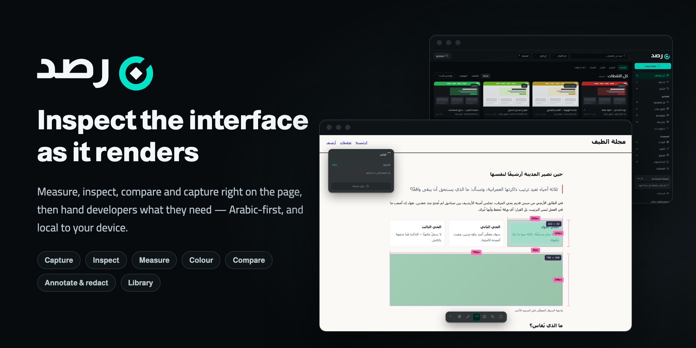</p>

Rasd is an Arabic-first visual inspection extension for people who build and review web interfaces. Capture, measure,
inspect, check colour and compare against a reference right on the live page, keep your findings on your device, and hand
developers what they need.

<p>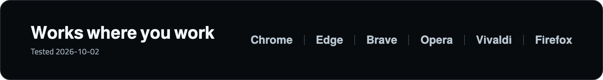</p>

<p>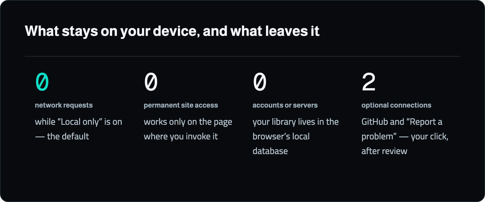</p>

- **Local by default** — “Local only” is on from the first run; while it is on, Rasd sends no network request at all.
- **No permanent site access** — it works only on the page where you invoke it.
- **Arabic-first** — the interface is Arabic and right-to-left, in dark and light themes.

<p><sub>Store links will be added here once Rasd is published.</sub></p>

---

<p align="center"><sub>
  تصميم وتطوير سلطان — Sultan · <a href="https://bysltan.com">bysltan.com</a><br>
  © 2026 — جميع الحقوق محفوظة.
</sub></p>
